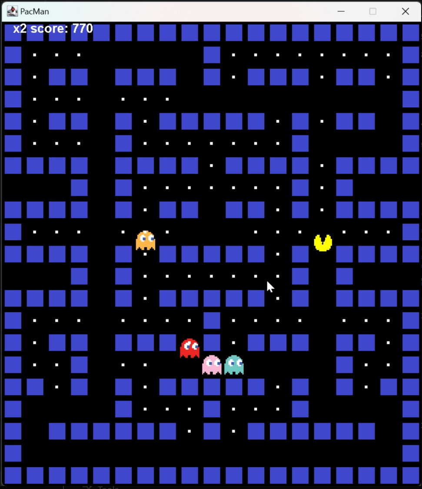
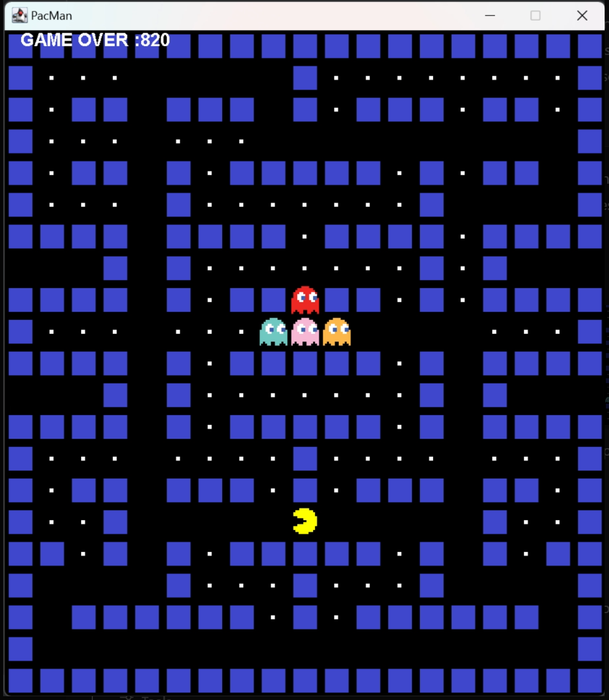

# Pac-Man (Java Swing Edition)

A lightweight, **pure-Java** re-creation of the classic 1980 arcade game.  
Built with nothing more than the Java SE platform and the Swing GUI toolkit, this project is perfect for:

* **Teaching** intro-level game-loop architecture, basic AI, and event-driven graphics
* **Demonstrating** Breadth-First Search (BFS) path-finding in a grid world
* **Having fun** and showing off a fully working desktop game that compiles in seconds

---
# 🎮 game_shots


## Pac-Man collecting pellets while ghosts patrol the maze:



## End-of-game sequence showing your final score:

---

## ✨ Features

| Category | Highlights |
|----------|------------|
| Gameplay | • Original maze & pellets<br/>• Four ghosts with individual sprites<br/>• Score, lives, win/lose logic |
| Graphics | • Tile-based board (32 × 32 px)<br/>• Double-buffered Swing painting<br/>• Custom sprite sheet (`*.png`) loading |
| AI       | • **BFS** every frame for smart ghost pursuit<br/>• Simple speed differential (Pac-Man is 2× faster than ghosts) |
| Code     | • Fewer than 600 source lines<br/>• No external libraries<br/>• Clear separation of model (Block), view (paintComponent), and controller (KeyListener) |

---

## 🕹️ Controls

| Key | Action |
|-----|--------|
| ⬆  | Move up |
| ⬇  | Move down |
| ⬅  | Move left |
| ➡  | Move right |
| *Any arrow after GAME OVER* | Restart with full lives |

---

## 📂 Project Layout
├── src/
│   ├── Main.java        # creates the JFrame and attaches the game panel
│   ├── PacMan.java      # game logic, rendering, input & BFS path-finding
│   └── resources/
│       ├── wall.png  )
│       ├── pacmanUp.png 
│       ├── pacmanDown.png  
│       ├── pacmanLeft.png  
│       ├── pacmanRight.png  [](https://github.com/sasanshafiei/SEN2212Project/blob/master/src/pacmanRight.png?raw=true)
│       ├── blueGhost.png  
│       ├── orangeGhost.png  
│       ├── redGhost.png  
│       └── pinkGhost.png  
└── README.md


---

## 🚀 Quick Start

1. **Prerequisites**

    * Java 11 or newer (JDK) on your `PATH`

2. **Compile**

   ```bash
   cd src
   javac Main.java PacMan.java

### In an IDE

1. Create a standard **Java SE** project.
2. Drop `src/` into the source folder and mark `resources/` as a resource root.
3. Run `Main`.

---

### 🔍 How It Works

- **Tile map** – `String[]` where
    - `X` = wall
    - (space) = pellet
    - `P` = Pac-Man spawn
    - `b / o / r / p` = ghosts
- **Game loop** – `Timer(55 ms)` → `move()` → `repaint()` ≈ 18 FPS
- **Movement** – Pac-Man speed = `tileSize / 4`, ghosts = `tileSize / 8`
- **Path-finding** – Each ghost runs **BFS** on a passable grid every frame
- **Collision** – Axis-aligned bounding boxes for walls, pellets & ghosts

---

### 🛠️ Customization

| Constant                   | File                         | Purpose            |
|----------------------------|------------------------------|--------------------|
| `rowCount`, `colCount`, `tileSize` | `Main.java` & `PacMan.java` | Board dimensions   |
| `tileMap[]`                | `PacMan.java`                | Level design       |
| `Timer(55, …)`             | `PacMan()`                   | Frame delay (ms)   |

---

### 🗺️ Roadmap

- Power-pellets & frightened mode
- High-score persistence
- Sound effects & music
- Multiple levels / difficulty scaling
- Android port (Java FX / LibGDX)

---

### 🤝 Contributing

1. **Fork** → create a feature branch
2. Commit with descriptive messages
3. Open a **pull request** with screenshots/GIFs

---

### 📜 License

Released under the **MIT License** – see `LICENSE`.

---

### 🙏 Credits

- Original game © 1980 **NAMCO**
- BFS reference – Amit Patel, *Red Blob Games*
- Sprites – [Kenney.nl](https://kenney.nl)
